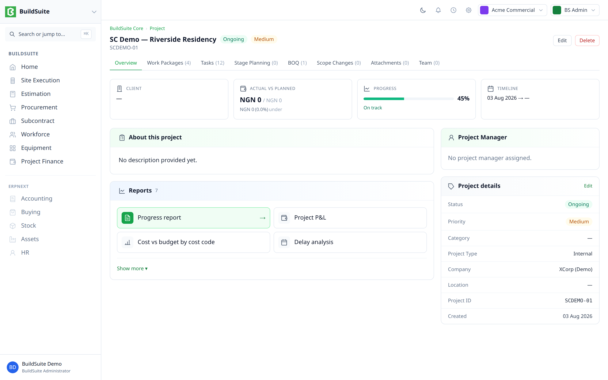
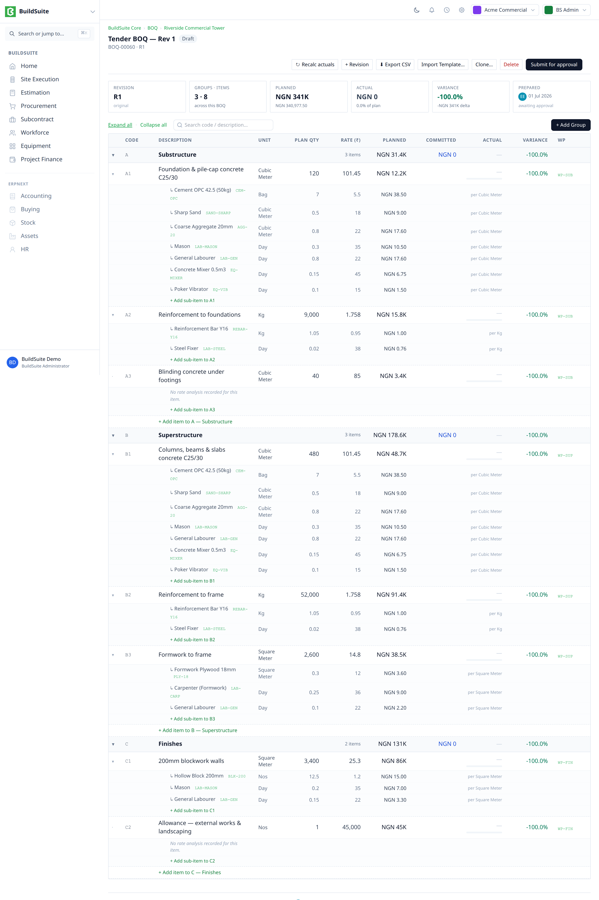
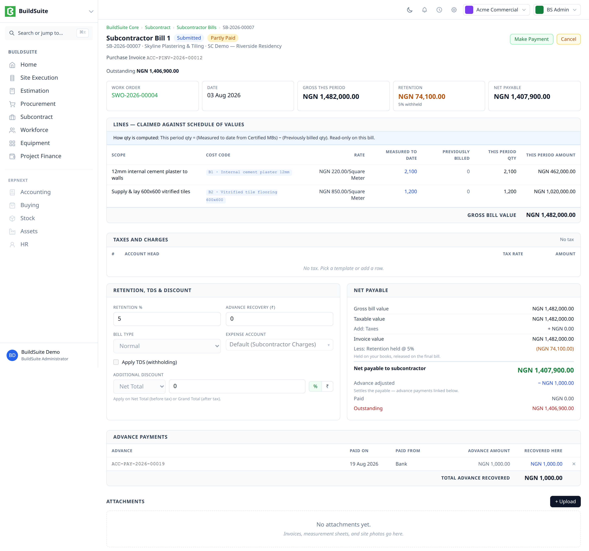

<div align="center">


# BuildSuite Core

**Construction operations for Frappe/ERPNext v16 — open source, MIT licensed.**

</div>

BuildSuite Core adds the things a contractor actually runs on top of ERPNext: a project spine with work packages and stage plans, estimation with a rate library, subcontract measurement and billing, site labour attendance, plant logging, and the money surfaces that tie them together.

It is built on the principle that construction software should not re-implement accounting. **BuildSuite owns the documents that capture construction reality; ERPNext owns the ledger.**

> **Beta.** All planned modules are shipped and installable. Interfaces are stable enough to build against, but this is a beta — expect rough edges, and please report them.

## Screenshots

**Project overview** — the spine: work packages, tasks, live progress roll-up, and project-scoped reports.



**BOQ tree** — revisions, groups and items, with assemblies exploded into their own components, units and rates.



**Subcontractor bill** — measured against a schedule of values, with the retention / advance / net-payable waterfall, generating a Purchase Invoice on submit.



## What's in it

| Module | What it does |
| --- | --- |
| **Site Execution** | Projects, sub-projects, work packages, tasks, progress entries with automatic roll-up, stage plans seeded from project templates |
| **Schedule** | Gantt with task types, FS/SS/FF dependencies with lag, flag-only and cascade rescheduling, cycle detection, stage slip |
| **Scope Change** | Scope change orders against a project, with cost impact and approval |
| **Estimation** | BOQ tree with revisions, assemblies with snapshot explosion, estimate templates, rate master with rate history, cost-code picker |
| **Procurement** | Material requests, purchase orders, goods receipts, consumption, supplier bills — full submit, cancel and amend lifecycle |
| **Subcontract** | Work orders with a schedule of values, measurement books with cumulative tracking, subcontractor bills that generate purchase invoices |
| **Workforce** | Field employees, crews, bulk daily muster generating labour attendance and overtime registers |
| **Equipment** | Machinery register, plant usage logs, hired and owned costing paths |
| **Project Finance** | Petty cash loop, expense entries with a verification gate, invoices, bills, payments, advances |
| **Reporting** | Project P&L, cost vs budget by cost code, delay analysis, billing and collection, subcontractor position, material status |

## Design principles

These are the decisions that shape the codebase. They're worth reading before contributing.

- **Thin instrument over canonical document.** BuildSuite documents capture construction reality — free-text subcontract lines, site measurement, daily musters. On submit they generate the standard ERPNext document that does the accounting. A subcontractor bill generates a Purchase Invoice; a petty cash disbursement generates a Payment Entry; an expense generates a Journal Entry. We never re-implement the ledger, which is why a customer can grow from the Vue app into full Desk accounting with no migration.
- **Cost codes, not per-item tracking.** Every cost-bearing line carries a cost code — either a BOQ group or a BOQ item. Costs roll up, never down. `cost_type` is derived from the document and the code, never stored on a transaction line, so it cannot drift.
- **HR-free core.** The Workforce module installs and runs on a site with no `hrms` present. It owns its own worker identity, crew and worker-type model, and does not link to Employee or Employment Type.
- **Company is asked once.** A user picks a company on the project. Every document below derives it, hidden and read-only. Single-company customers never meet the field; multi-company customers get record-level scoping through Frappe's own user permissions. Shared masters — rate master, task types — carry no company at all.
- **Advances settle, they don't deduct.** Linking an advance to a bill or invoice reduces outstanding, like a payment. It never changes a posted total. That is what makes linking a submitted document legitimate.
- **Derived records are never edited.** Labour attendance and overtime registers are written by submitting a muster. Corrections go through cancel and amend on the source, so the registers can never disagree with what produced them.

## Requirements

- Frappe Framework v16
- ERPNext v16
- MariaDB 10.6+, Redis, Node 18+, Python 3.11+ (per Frappe v16's own requirements)

For Indian GST, install [India Compliance](https://github.com/resilient-tech/india-compliance) alongside. BuildSuite generates standard Purchase Invoices, so they reconcile against GSTR-2B in the normal way.

## Installation

```bash
# from your bench directory
bench get-app https://github.com/BuildSuite-io/buildsuite_core
bench --site <your-site> install-app buildsuite_core
bench --site <your-site> migrate
bench build
```

Then open your site and follow the setup wizard. It seeds the construction chart of accounts, the finance accounts, GST tax templates and cost heads — you should not need to configure accounts by hand.

## First project in five minutes

1. **Create a project.** Pick a project type — the stage plan seeds itself from the template.
2. **Add a work package and a few tasks.** File a progress entry; watch the parent task and stage roll up on their own.
3. **Build a BOQ.** Add a group, then items. Explode an assembly and the components arrive with their own units and rates.
4. **Raise a material request,** turn it into a purchase order, receive it, and consume it against a task. The cost lands on the cost code.
5. **Open the project P&L.** Everything you just did is in it.

## Not in this release

Being explicit about the edges:

- Client-facing RA / progress billing and client-side retention — separate track
- Credit and debit notes, payment reminders — fast-follow
- GST returns, bank reconciliation, fixed assets and depreciation — use Desk; these are ERPNext's own, and we don't wrap them
- Timesheet — lives in the private Workforce app, not core
- Journal entry UI — deliberately never. A manual JV is a Desk moment.

## Reporting issues

Please open an issue with your Frappe and ERPNext versions, the module, and what you expected versus what happened. Screenshots help. If it involves accounting, the resulting GL entries help more.

## Contributing

Contributions are welcome. A few things worth knowing:

- Read the design principles above first. Most review comments trace back to one of them.
- Generated documents must be **idempotent** (one source, one target, re-submit never duplicates) and **atomic** (generation failure rolls back the submit).
- Anything cost-bearing carries `project` and `cost_code`. `cost_type` is derived.
- New behaviour needs a test. The suite runs in CI.

## License

MIT. See [LICENSE](LICENSE).

## Acknowledgements

Built with support from the Frappe Incubator programme, on Frappe Framework and ERPNext.
